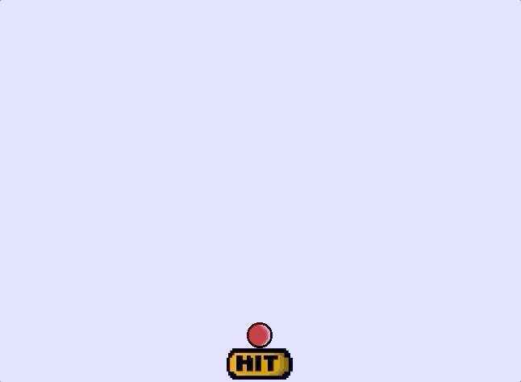
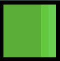
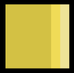
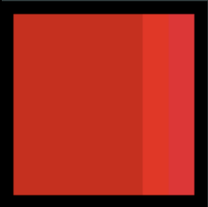
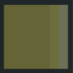
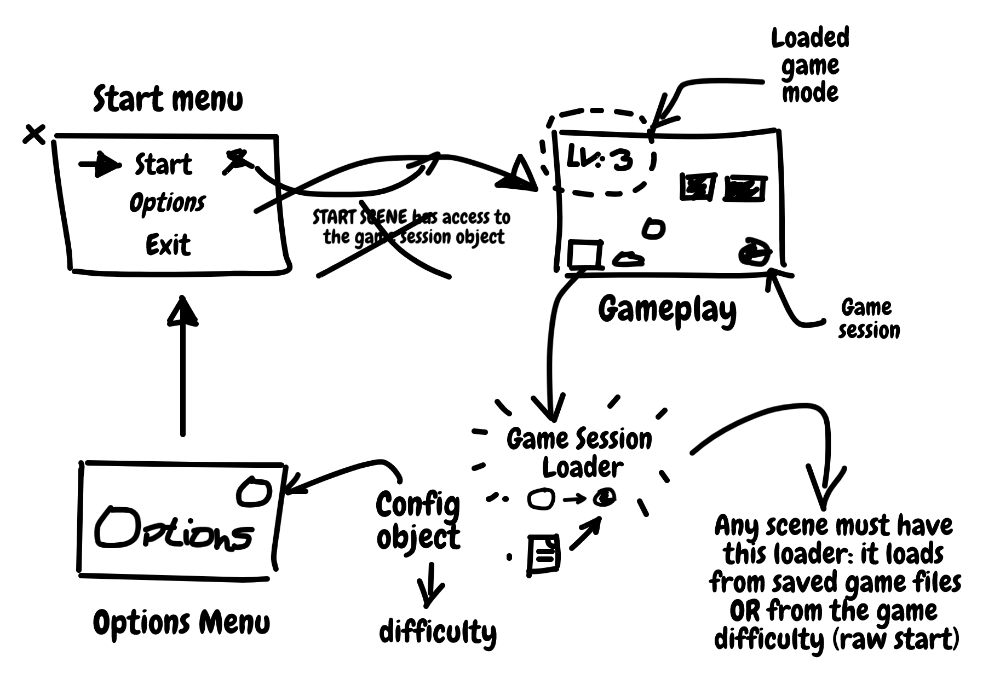
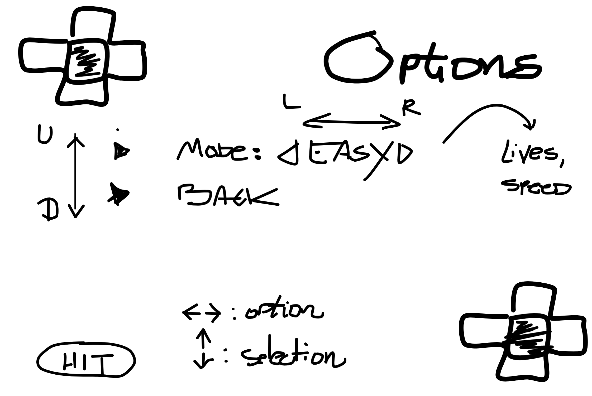

# Brick Breaker

A simple brick breaker game created with Unity and C# with many VFX, SFX and game soundtracks!



## Features

- `Game Menus` (main, instructions and options) which allows the player to understand and customize the game difficulty
- `Player score`, `player lives` and `game speed` that changes according to the set game difficulty
- `Various blocks` to destroy (with many colors, sizes and health points)
- `Particle effects` that are generated randomly when blocks are destroyed
- `VFX and SFX` that are played when the balls bounces 
 - `Soundtracks`: each level/scene has its own sound track! All credits to the artists!

**DISCLAIMER**: This is a `non-commercial` project which was created only for educational purposes. 

## Brick Breaker's Official Sound Track (OST)

### Soundtracks

I thank A LOT the following artists for the soundtracks that were used on this game! These tracks were download from http://dig.ccmixter.org.

- `Menus`:
    - nightWalk by airtone (c) copyright 2017 Licensed under a `Creative Commons Attribution (3.0) license`. 
    - http://dig.ccmixter.org/files/airtone/56520
    
- `Level 1`: 
    - reNovation by airtone (c) copyright 2019 Licensed under a `Creative Commons Attribution (3.0) license`. 
    - http://dig.ccmixter.org/files/airtone/60674  
    
- `Level 2`: 
    - ukeSounds by airtone (c) copyright 2011 Licensed under a `Creative Commons Attribution (3.0) license`. 
    - http://dig.ccmixter.org/files/airtone/32655
     
- `Level 3`: 
    - Not too quiet by zikweb (c) copyright 2008 Licensed under a `Creative Commons Attribution (3.0) license`.
    - http://dig.ccmixter.org/files/zikweb/17624  
    
- `Game Over`: 
    - Midnight Theme (cdk mix) by Analog By Nature (c) copyright 2008 `Licensed under a Creative Commons Attribution (3.0) license`.
    - http://dig.ccmixter.org/files/cdk/14246 

### Sound effects

The ball bouncing sounds and block destruction sounds were download from the internet:

- `Block hits`: NeoSpica - https://freesound.org/people/NeoSpica/sounds/512243/

# Game Manual

The game objective is simple: BREAK all the blocks without having your player lives reduced to zero!

- `TO WIN to the next level`: break ALL the blocks on the current level
- `TO BREAK the blocks`: hit them with the ball!
- `TO LOSE a life`: let the ball fall down (off the screen)
- `TO LOSE THE GAME`: let your player lives drop to **less than zero**

## Game Modes (difficulties)

The `harder` the game is... 

- the `less lives` the player has;
- the `faster the ball` speed is;
- `higher rewards` are offered per `destructed block`!

So... the old high risk, high reward dilemma, huh? YES! 

### 1. Easy

For cry babies, really. You will win, be happy with that.

- `Player lives`: 3
- `Points per block`: 50
- `Gamespeed`: slow

### 2. Normal

For casual players, but here you struggle eventually, but nothing that will give nightmares. 

- `Player lives`: 3
- `Points per block`: 100
- `Gamespeed`: normal

### 3. Hard

The game's is hard, the ball goes there and here like crazy! Good luck!

- `Player lives`: 2
- `Points per block`: 300
- `Gamespeed`: fast

### 4. Inhuman

The game's is insanely fast, probably not designed for humans... maybe? Got guts to face it?

- `Player lives`: 1
- `Points per block`: 500
- `Gamespeed`: blazing fast

## Blocks (yes, they are your enemies)

 ### 1. The IGU block
 
The most common block type, found easily on any level.
 
  
- `health`: 1 ball hit
- `size`: normal

 ### 2. The BALD block
 
A stronger block, still easy to find on any level. Takes 2 hits!
 
 
 - `health`: 2 ball hits
 - `size`: normal

 ### 3. The BEAR block
 
A chubby block, very strong that takes many hits. Watch out, tough enemy!
 
 
 - `health`: 3 ball hits
 - `size`: normal
 
 ### 4. The BALTHAZAR'S MOUNTAIN block
  
The BOSS of the blocks! The fattest and strongest! Ultra care is recommended against this tough guy.
  
 
  - `health`: 6 ball hits 
  - `size`: 6x bigger than normal
  
### 5. The ALMOST-INVISIBLE block

A barely visible block that does... nothing! Offers no collisions so the ball won't bounce!
  

- `health`: Indestructible
- `size`: normal
  
### 6. The GODLIKE block

The IMMORTAL block: indestructible! Don't even waste your time on it. It HAS collisions and will make the ball bounce like crazy!
  

- `health`: Indestructible
- `size`: normal

## Gaming Technologies

For this game, the following tools were used:

- `Unity 2019.3.7f1`;
- `C#`;
- `Piskel` for drawing 8-bits themed sprites (https://www.piskelapp.com/).

## Running Tests

To run the tests, Unity must be installed on the host machine. The tests of the project can be run on a pipeline 
using the `tests.sh` bash script. However, it will require the following parameters:

- `Path to Unity`;
- `Project folder`

These two must be passed as parameters to the bash script. The output of the tests will be an XML file with the name:

`test-results.xml`

Example:

```bash
# Running on a macOS machine
bash tests.sh /Applications/Unity/Hub/Editor/2019.3.7f1/Unity.app/Contents/MacOS/Unity ~/Documents/git/brick-breaker
```

## Curiosity: Game Sketches and Ideas

Some sketches used to draw some ideas and bring them to life!

### Game Session and Game Session Loader

Game session (player lives, scores, game speed, etc.) is initialized by a dedicated class: `GameSessionLoader`
which can also be used to LOAD future saved game files. 



### Options menu

A draft of the options menu mechanics


